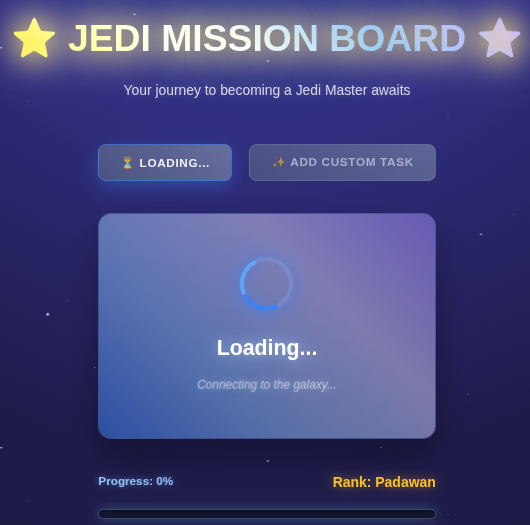
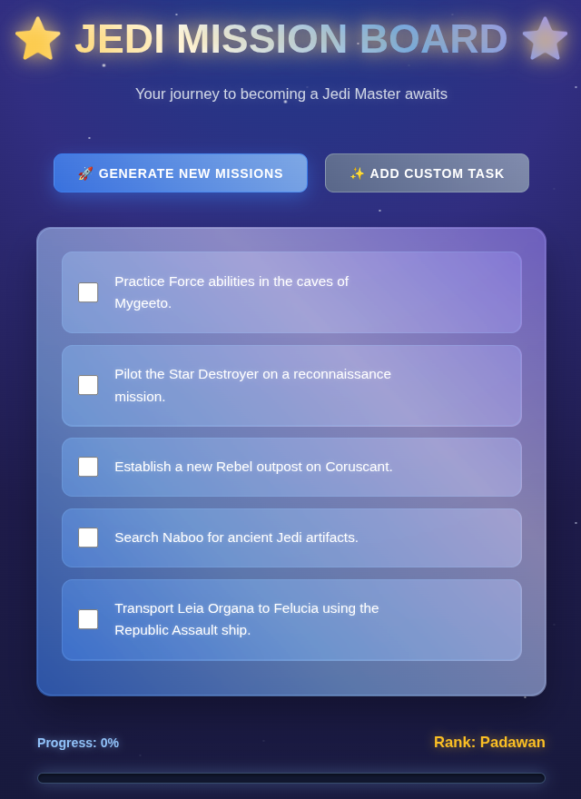
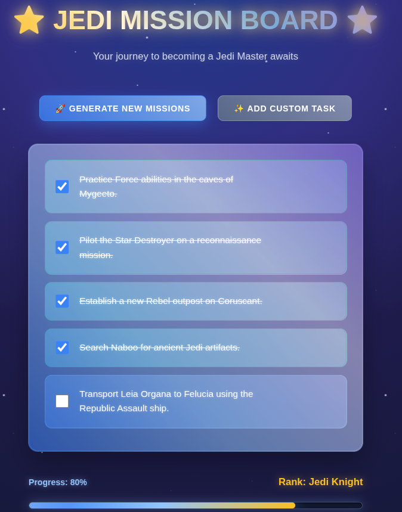
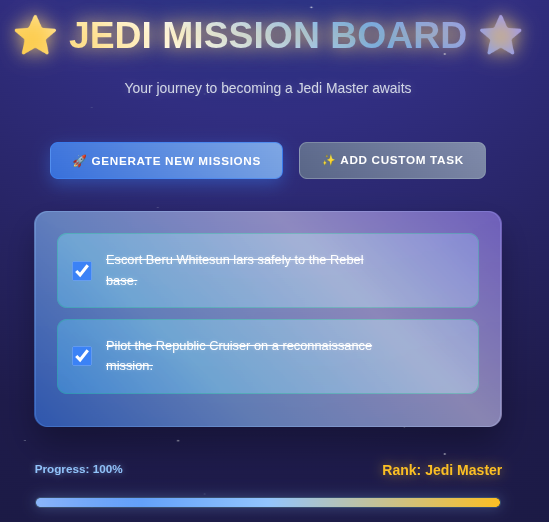
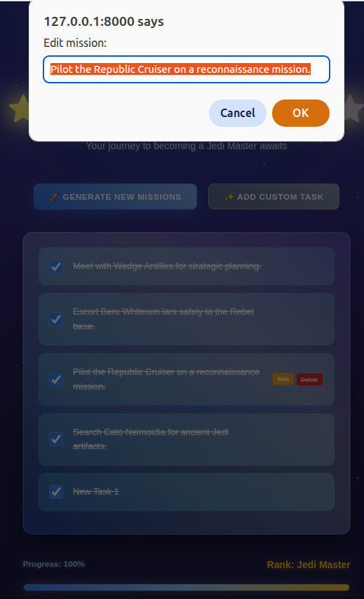
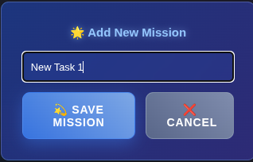
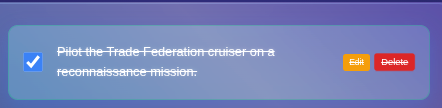

# Star Wars Mission Board
  Interactive todo application with a stunning Star Wars theme.
Generate random Jedi missions using real Star Wars API data and track your progress as you advance through Jedi ranks!
The app generates random Jedi missions using data from the Star Wars API (SWAPI) and presents them in a space-themed interface complete with floating planets, twinkling stars, and lightsaber effects.

# Key Features
- Dynamic Mission Generation: Creates unique Star Wars missions using real character, planet, starship, and vehicle data from SWAPI
- Beautiful Space Theme: Animated background with floating planets, starry sky, and cosmic effects
- Jedi Ranking System: Progress from Padawan to Jedi Master based on completed missions
- Responsive Design: Works perfectly on desktop and mobile devices
- Custom Missions: Add your own custom missions alongside generated ones
- Progress Tracking: Visual progress bar with glowing effects

# Prerequisites
- Python 3.8 or higher  
- Django 4.0 or higher  
- Internet connection (for SWAPI data)

# Installation & Setup
1. Clone the Repository
```bash
git clone <repository-url>
cd StarWars_ToDo
```

2. Create Virtual Environment
```bash
# Create virtual environment
python -m venv .venv
# Activate virtual environment

# On Windows:
.venv\Scripts\activate

# On macOS/Linux:
source .venv/bin/activate
```

3. Install Dependencies
```bash
# Install production dependencies
pip install -r requirements.txt
```

4. Setup Django
```bash
# Run migrations
python manage.py migrate

# Create superuser (optional)
python manage.py createsuperuser

# Collect static files (if needed)
python manage.py collectstatic --noinput
```

5. Run the Application
```bash
python manage.py runserver
```
Visit ```http://127.0.0.1:8000/``` to see your Star Wars Mission Board!

# Running Tests
The application includes unit tests for the SWAPI integration:
```
pip install pytest

# From the tests/ directory:
pytest test_swapi.py -v
```

# Test Coverage
The test suite covers:

- API data fetching with error handling  
- Caching mechanisms  
- Fallback systems when API is unavailable  
- Random data selection  
- Integration workflows  

# Data Sources
Primary Data Source: Star Wars API (SWAPI)
URL: ```https://www.swapi.tech/api/```  
Endpoints Used:  
- /people - Characters
- /planets - Planets
- /starships - Starships
- /vehicles - Vehicles


# Backup data
When the API is unavailable, the app uses selected backup lists with:
- 10+ iconic characters from Star Wars, famous planets from the saga, etc.


# Screenshots
<div style="display: flex; justify-content: space-between; align-items: flex-start;">
  
  
  
  
  
  
  
</div>
